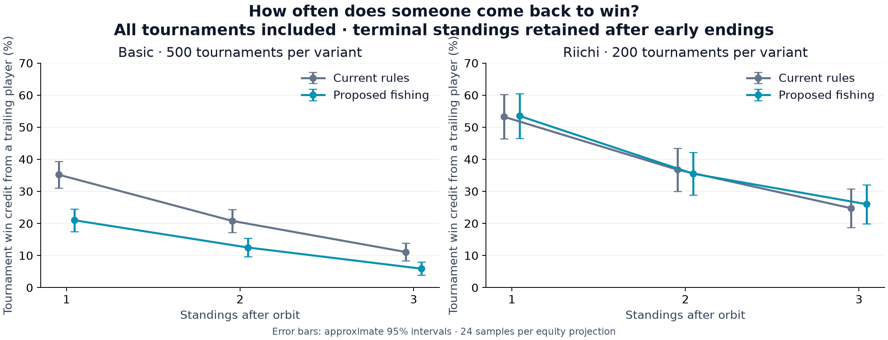
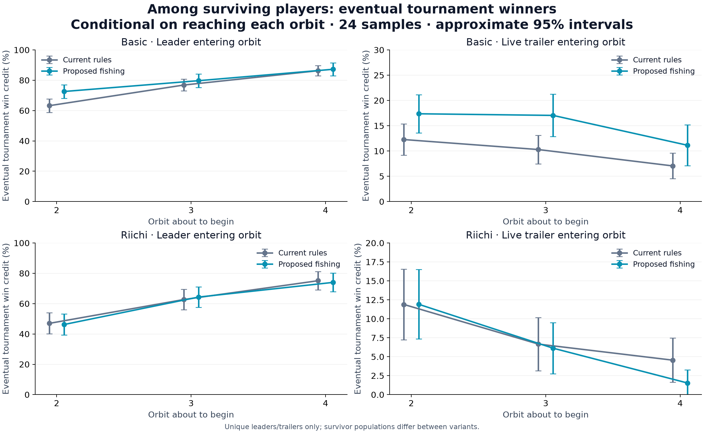

# Fishing rules: hand building and catch-up

25 September 2026. **2,400 retained completed simulations, covering 19,369 hands. All bots use 24 samples per equity projection.**

This experiment compares the current upgraded bots and rules with bots adapted to the proposed fishing rules. The app remains on the current rules; the experimental engine and bots are preserved separately.

**Recommendation:** do not adopt the Basic version as written with these bots and settings. Riichi delivers more hand building, but this experiment does not demonstrate a tournament catch-up improvement.

Basic’s share of tournament wins coming from someone behind after Orbit 1 falls from **35.20% to 21.00%**: −14.20 percentage points, with an approximate 95% paired interval of −19.28 to −9.12. By that checkpoint, **22.80%** of proposed-rule tournaments have already ended, versus **3.40%** under current rules.

Riichi’s corresponding four-orbit figure is **53.25% → 53.50%**. The change is +0.25 points with an interval of −9.54 to +10.04, so this sample cannot establish a benefit or rule out moderate effects. Its last-place survivor entering Orbit 2 wins about **11.9%** under either rule set.

## Rules and comparison

- Basic: a free fishing step after Check, Call, and Bet/Raise.
- Riichi: a free step after Check or Call; a stick buys a second step after either, or a fishing step after Bet/Raise.
- Existing all-in and declared-Riichi locks remain, as requested. A hand that has already ended uncontested has no fishing step.
- Main cohorts: 500 paired deal seeds per variant in Basic (four continuous orbits) and Riichi (one orbit), with 200 initial chips and no resets between orbits.
- Extra catch-up cohort: 200 paired four-orbit Riichi tournaments per variant. Its results are separate from the one-orbit health comparison.

## Hand building and table activity

| Measure | Basic: current → proposed | Riichi, one orbit: current → proposed |
| --- | ---: | ---: |
| Hands reaching Street 4 | 33.60% → 18.05% | 47.95% → 49.95% |
| Fishing steps per hand | 5.53 → 6.07 | 7.17 → 8.85 |
| Deck draws per hand | 3.88 → 4.32 | 5.26 → 6.17 |
| Lane draws/exchanges per hand | 1.65 → 1.75 | 1.90 → 2.67 |
| Cards in both lanes at a betting decision | 4.53 → 4.70 | 5.22 → 5.72 |
| Fold rate when facing a wager | 41.17% → 20.66% | 18.32% → 18.04% |
| Hands ending uncontested | 45.68% → 42.18% | 15.95% → 15.15% |
| Hands ending during Street 1 | 27.49% → 35.59% | 38.55% → 32.05% |
| Ante-triggered immediate showdowns | 2.12% → 2.32% | 1.20% → 2.10% |
| Hands with an all-in | 33.55% → 49.76% | 38.50% → 37.50% |
| Strongest initial hand’s eventual win credit | 67.41% → 64.47% | 52.48% → 48.58% |
| Showdown players improving on initial hand | 62.97% → 74.04% | 65.99% → 72.28% |
| Betting actions per hand | 9.25 → 7.80 | 14.19 → 13.63 |
| Hands per tournament/game | 10.87 → 7.07 | 4.00 → 4.00 |
| Players eliminated | 48.80% → 64.40% | 0.00% → 0.00% |
| Loans per tournament/game | 0.00 → 0.00 | 0.73 → 0.74 |
| Negative final scores | 0.00% → 0.00% | 13.15% → 13.80% |

Selected paired changes (approximate 95% bootstrap intervals, resampling whole games):

| Measure | Basic change | Riichi change |
| --- | ---: | ---: |
| Street 4 reach | -15.56 pp [-17.41, -13.77] | +2.00 pp [-0.30, +4.30] |
| Fishing steps per hand | +0.54  [+0.35, +0.73] | +1.68  [+1.40, +1.96] |
| Initial strongest-hand win credit | -2.94 pp [-4.91, -0.96] | -3.90 pp [-6.35, -1.42] |
| Fold rate facing wager | -20.50 pp [-21.96, -19.06] | -0.27 pp [-1.07, +0.54] |

## Catch-up across orbits

Positions are measured **entering each orbit**, after the previous settlement and before the next ante/loan. Leader and live trailer mean unique first and last place among players still able to play. Ties are excluded from these two groups; final tied wins split credit. Riichi standings deduct 250 points per loan. Everyone starts the first orbit tied, so the informative checkpoints begin at Orbit 2.

### Basic: recovery across all tournaments

This table keeps every tournament in the denominator. If play ended early, its terminal standings are carried forward. It measures how often the eventual champion came from behind at a fixed checkpoint, without selecting only tournaments that survived longer.

| After orbit | Champion was behind: current → proposed | Champion was last: current → proposed | Already finished: current → proposed | Change in champion-from-behind share, 95% interval |
| --- | ---: | ---: | ---: | --- |
| 1 | 35.20% → 21.00% | 4.40% → 0.00% | 3.40% → 22.80% | -14.2 pp [-19.3, -9.1] |
| 2 | 20.80% → 12.50% | 1.00% → 0.00% | 9.00% → 37.80% | -8.3 pp [-12.9, -3.7] |
| 3 | 11.10% → 5.90% | 0.40% → 0.00% | 18.00% → 53.00% | -5.2 pp [-8.7, -1.7] |

### Basic: eventual tournament winner

| Entering orbit | Tournaments reaching checkpoint, current / proposed | Leader win credit, current → proposed | Live trailer win credit, current → proposed | Eligible live trailers, current / proposed |
| --- | ---: | ---: | ---: | ---: |
| 2 | 483 / 386 | 63.23% → 72.58% | 12.27% → 17.37% | 432 / 380 |
| 3 | 455 / 311 | 76.84% → 79.71% | 10.29% → 17.05% | 442 / 308 |
| 4 | 410 / 235 | 86.30% → 87.23% | 7.05% → 11.14% | 397 / 229 |

| Entering orbit | Live trailer reaches/shares lead during orbit | Live trailer ends orbit leading (shared credit) | Live trailer wins largest orbit gain (shared credit) | Final-win-rate change, approximate 95% interval |
| --- | ---: | ---: | ---: | --- |
| 2 | 12.27% → 12.11% | 10.53% → 9.74% | 31.17% → 35.53% | +5.1 pp [+0.6, +9.6] |
| 3 | 8.60% → 13.31% | 7.01% → 11.85% | 34.80% → 41.07% | +6.8 pp [+1.5, +12.0] |
| 4 | 8.31% → 12.66% | 7.05% → 11.14% | 40.05% → 43.01% | +4.1 pp [-0.7, +8.9] |

### Basic: deficit entering Orbit 2

Live players behind the leader, conditional on reaching Orbit 2. Deficits are net-score points; counts are player observations clustered by tournament.

| Deficit | Current: eventual win credit (observations) | Proposed: eventual win credit (observations) |
| --- | ---: | ---: |
| up to 50 | 24.60% (187) | 37.96% (54) |
| >50–150 | 27.14% (105) | 42.86% (63) |
| >150–300 | 21.02% (364) | 22.47% (89) |
| >300 | 8.20% (305) | 11.65% (322) |

### Riichi: recovery across all tournaments

This table keeps every tournament in the denominator. If play ended early, its terminal standings are carried forward. It measures how often the eventual champion came from behind at a fixed checkpoint, without selecting only tournaments that survived longer.

| After orbit | Champion was behind: current → proposed | Champion was last: current → proposed | Already finished: current → proposed | Change in champion-from-behind share, 95% interval |
| --- | ---: | ---: | ---: | --- |
| 1 | 53.25% → 53.50% | 12.00% → 12.00% | 0.00% → 0.00% | +0.3 pp [-9.5, +10.0] |
| 2 | 36.75% → 35.50% | 6.50% → 6.00% | 0.00% → 0.00% | -1.3 pp [-10.6, +8.1] |
| 3 | 24.75% → 26.00% | 4.50% → 2.00% | 0.00% → 0.00% | +1.3 pp [-7.0, +9.5] |

### Riichi: eventual tournament winner

| Entering orbit | Tournaments reaching checkpoint, current / proposed | Leader win credit, current → proposed | Live trailer win credit, current → proposed | Eligible live trailers, current / proposed |
| --- | ---: | ---: | ---: | ---: |
| 2 | 200 / 200 | 46.98% → 46.23% | 11.89% → 11.92% | 185 / 193 |
| 3 | 200 / 200 | 62.69% → 64.32% | 6.67% → 6.12% | 195 / 196 |
| 4 | 200 / 200 | 75.13% → 74.00% | 4.55% → 1.53% | 198 / 196 |

| Entering orbit | Live trailer reaches/shares lead during orbit | Live trailer ends orbit leading (shared credit) | Live trailer wins largest orbit gain (shared credit) | Final-win-rate change, approximate 95% interval |
| --- | ---: | ---: | ---: | --- |
| 2 | 5.41% → 7.25% | 3.78% → 6.22% | 15.68% → 20.98% | +0.0 pp [-6.3, +6.4] |
| 3 | 3.08% → 6.12% | 1.03% → 3.06% | 16.41% → 21.43% | -0.5 pp [-5.4, +4.3] |
| 4 | 5.05% → 1.53% | 4.55% → 1.53% | 22.47% → 23.21% | -3.0 pp [-6.4, +0.4] |

### Riichi: deficit entering Orbit 2

Live players behind the leader, conditional on reaching Orbit 2. Deficits are net-score points; counts are player observations clustered by tournament.

| Deficit | Current: eventual win credit (observations) | Proposed: eventual win credit (observations) |
| --- | ---: | ---: |
| up to 50 | 52.38% (21) | 58.82% (17) |
| >50–150 | 36.67% (30) | 35.00% (40) |
| >150–300 | 15.49% (71) | 26.67% (90) |
| >300 | 15.41% (477) | 13.05% (452) |

### Four-orbit Riichi health context

| Measure | Current → proposed |
| --- | ---: |
| Street 4 reach | 30.81% → 33.84% |
| Fishing steps per hand | 4.78 → 6.55 |
| Hands with an all-in | 53.34% → 51.91% |
| Loans per four-orbit tournament | 4.98 → 5.04 |
| Negative final scores | 45.38% → 46.88% |

## Economy and score spread

| Mode | Variant | Score p10 / median / p90 | Median winner–last gap |
| --- | --- | ---: | ---: |
| basic | current | 0.0 / 0.0 / 730.0 | 625.0 |
| basic | proposed | 0.0 / 0.0 / 800.0 | 800.0 |
| riichi | current | -55.0 / 105.0 / 575.0 | 597.5 |
| riichi | proposed | -60.0 / 110.0 / 595.0 | 600.0 |

## Interpretation and limits

Basic does reduce folding under pressure (41.17% → 20.66%) and increases the fraction of showdown players who improved their hand (62.97% → 74.04%). Those gains come with more all-in hands (33.55% → 49.76%), fewer completed hands per tournament (10.87 → 7.07), and more formal eliminations (48.80% → 64.40%). The all-in lock still ends fishing. This is consistent with additional fishing feeding larger confrontations, rather than preserving recovery opportunities; the experiment does not isolate each causal component.

The conditional Basic trailer figures look better among survivors: entering Orbit 2, their final win credit rises from 12.27% to 17.37%. That group is smaller and faces a different surviving field. It does not overturn the all-tournament result: many more tournaments and players have already lost the chance for a comeback.

Riichi increases fishing from 7.17 to 8.85 steps per hand (+23.5%), raises average combined lane occupancy from 5.22 to 5.72 cards, and reduces the strongest initial hand’s eventual win credit from 52.48% to 48.58%. Street 4 rises from 47.95% to 49.95%, but its +2.0-point interval spans −0.3 to +4.3 points. Loans are almost unchanged (0.728 → 0.744 per one-orbit game; 4.98 → 5.035 over four orbits). The activity gains are clearer than the pacing or recovery gains.

The next Basic variant worth testing is free fishing after Check/Call while betting gives up that free draw. That has not been tested in this experiment. It would directly test whether allowing defenders to build, without also giving aggressors a free improvement, better serves the catch-up goal while retaining the requested locks.

This is a rules-plus-bot comparison at a fixed planning budget, not a head-to-head win-rate test between rule systems. Opponent-response estimates remain heuristic. More draws or bigger lanes do not by themselves establish better balance; catch-up and survival must be considered alongside activity.

The live-player catch-up rates are conditional on the tournament reaching that orbit and on a unique eligible leader/trailer existing. Changes in who survives can change those populations. The all-tournament checkpoint analysis retains the full cohort, including early endings. The raw data also retain absolute-last-place recovery, rank transitions, and deficit buckets. Approximate intervals resample or cluster by tournament, not by treating hands or repeated player observations as independent. They are exploratory comparisons without multiple-comparison adjustment.

Initial-hand strength is measured after Charleston and before betting, except ante-triggered showdowns, which use the dealt cards. Improving at showdown includes tie-break improvement and is conditional on reaching showdown. Lane occupancy is observed at betting decisions. These are descriptive measures, not causal proofs of bullying or player enjoyment.

## Reproduction and validation

- [Experiment design, definitions, and commands](fishing-experiment-2026-09-25/README.md)
- [Frozen source hashes and configuration](fishing-experiment-2026-09-25/manifest.json)
- [Main health data and intervals](fishing-experiment-2026-09-25/summary.json)
- [Catch-up data, sample counts, rank transitions, and deficits](fishing-experiment-2026-09-25/catchup.json)
- [Simulation runner](../scripts/experiment-fishing.ts)
- [Rule and orbit-checkpoint tests](../tests/fishing-experiment.test.ts)

Validation passed all 97 unit tests, strict TypeScript checking of the experiment, and targeted lint/format checks. The runner checks chip and stick conservation and retains each completed game. Rule tests cover the action/mode matrix, paid second draws after Call, locked hands, a two-step Twin Lotus retrieval, net-score orbit checkpoints, and hidden-information invariance for the new Basic forecasts. Interrupted exploratory batches and deterministic fixtures are excluded from the 2,400-game count.
