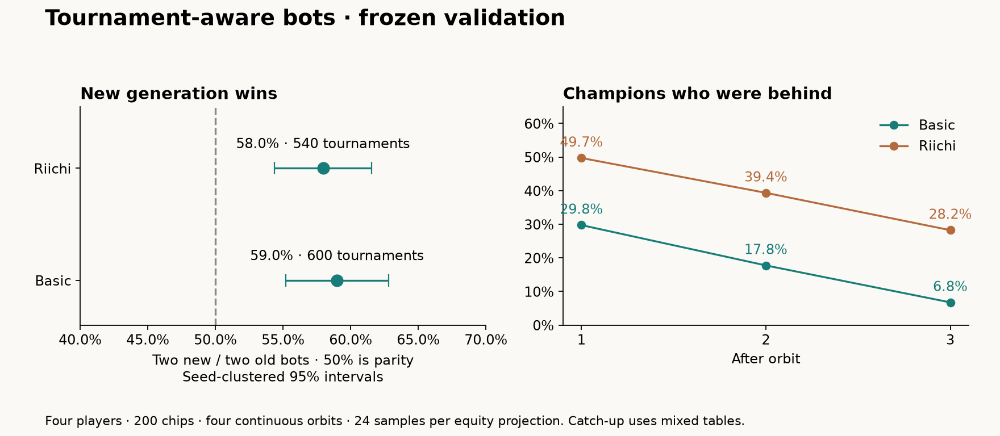

# Tournament-aware bots and shared fishing rules — 25 September 2026

**The new generation beats the previous generation in both modes.** Check and Call now each fish for free in both modes; Bet/Raise gives no free fish. Riichi sticks still buy one Bet fish or a second Check/Call fish. Existing all-in and declared-Riichi locks remain. The application, CLI and rule sheets agree.

## Competitive result

The user stopped the oversized batch. **1,148 competitive tournaments had completed; 1,140 are analyzed**, retaining complete six-seat rotations and excluding eight games in incomplete rotations. No interrupted game is counted. An additional 12 health tournaments completed before stopping, but their unequal, tiny cohorts are not used for population comparisons.

Four players, 200 starting chips, four continuous orbits, five-chip ante, **24 actual samples per equity projection**. Each table contains two independent new bots and two previous-generation bots. Each seed runs all six assignments of the new seats. The baseline is adapted to the same fishing rules; its previous decision models are retained. Ties split winner credit. The approximate 95% intervals cluster by seed.

| Mode | Tournaments / seeds | New generation winner share (95% interval) | Previous generation | Mean new-minus-old score per player |
|---|---:|---:|---:|---:|
| Basic | 600 / 100 | **59.0%** [55.2%, 62.8%] | 41.0% | -10.6 |
| Riichi | 540 / 90 | **58.0%** [54.4%, 61.5%] | 42.0% | +115.5 |

Both intervals exclude the 50% parity point. These are combined shares for the two bots of each generation, not individual 50% win probabilities. Development runs and superseded validation prefixes are excluded. The run was stopped for time at the user’s request, not when a favorable score threshold was crossed.

## Why hands end all-in

The old bots were mainly optimizing current-hand chip value, with limited tournament awareness. The audit found several avoidable errors:

- Each raise renewed a risk budget instead of accounting for the entire hand’s committed chips.
- Tiny raises were credited with substantial fold equity even when calling cost about 1% of the pot; some audit hands contained 21–26 raises.
- Opponent hands were insufficiently conditioned on their public betting aggression.
- Uncertainty adjustment invented roughly 6% equity in two Basic calls already beaten by exposed cards, with fishing locked.
- A previously fished card could be counted twice after exposure, manufacturing combinations or Twin Lotus in forecasts.

The revised bots budget whole-hand exposure, model public aggression and price-sensitive folds, account for reduced effective sample size, preserve proven losses, and remove duplicate known cards. They use cumulative scores, loan penalties and remaining dealer progress. They bank guaranteed leads and prioritize approximate tournament winner credit on the final hand. Known opposing Twin Lotus stops hopeless fishing. Riichi lead guarantees reserve a possible Single Lotus payment.

All-ins also follow from the rules. **One short stack’s all-in ends fishing for the whole table**, after the remaining calls and folds resolve. A smaller subsequent caller can lower the cap and refund previous contributions; an all-in count therefore does not imply a zero-chip finish. Riichi automatically lends when an ante cannot be funded, keeping depleted players in circulation. A trailer seeking first place may rationally take risks that lower expected chips. Twin Lotus has no reason to allow further development.

In the ten baseline audit games, the first all-in was caused by **38 Calls, eight Bets and five antes**. The larger mixed-table results below show that the distribution differs by mode:

| Mixed-table metric | Basic | Riichi |
|---|---:|---:|
| Hands containing an all-in | 26.3% | 55.0% |
| Hands reaching Street 4 | 34.2% | 28.2% |
| All-in before Street 4 | 23.6% | 53.6% |
| Players marked eliminated | 37.1% | 0.0% |
| Fishing steps per hand | 6.18 | 5.79 |
| Bets/raises per hand | 1.74 | 3.22 |
| Loans per tournament | 0.00 | 5.16 |
| Negative final scores | 0.0% | 48.3% |
| Blank exchanges per hand | 0.00 | 0.15 |
| Sticks spent per hand | 0.00 | 1.06 |
| Riichi declarations per hand | 0.00 | 0.29 |

| First all-in cause | Basic | Riichi |
|---|---:|---:|
| Bet | 1055 | 741 |
| Call | 763 | 3656 |
| Ante | 210 | 356 |

These are mixed-generation tables, not a controlled estimate of all-new bot pacing or of the fishing rule alone. Eliminations count failed-ante status; losing the last chips on the final hand may not trigger another ante check. Blank exchanges count as fishing steps.

## Catch-up by orbit

The following uses all analyzed mixed tables. It measures the share of final champions who were behind the leader at each checkpoint; ties split credit. Early-ended tournaments retain terminal standings, so eliminated players and early finishes do not disappear from the denominator.

| Checkpoint | Basic: champion was behind | Riichi: champion was behind |
|---|---:|---:|
| After Orbit 1 | 29.8% | 49.7% |
| After Orbit 2 | 17.8% | 39.4% |
| After Orbit 3 | 6.8% | 28.2% |

For a player-level view, the next table conditions on reaching that orbit and having a unique live leader or trailer. Basic players need five chips for the next ante; Riichi players can continue through loans. The final column asks whether the trailer earned the largest net-score gain during that orbit, splitting tied credit.

| Mode / entering orbit | Leaders: sample / eventual win | Live trailers: sample / eventual win | Trailer best net gain that orbit |
|---|---:|---:|---:|
| Basic / 2 | 588 / 70.2% | 543 / 5.8% | 25.6% |
| Basic / 3 | 585 / 82.0% | 580 / 5.1% | 36.3% |
| Basic / 4 | 582 / 93.0% | 578 / 2.5% | 43.9% |
| Riichi / 2 | 539 / 50.2% | 513 / 10.9% | 20.9% |
| Riichi / 3 | 539 / 60.8% | 535 / 7.3% | 17.9% |
| Riichi / 4 | 539 / 71.7% | 536 / 1.7% | 16.0% |

**Basic has a structural early-lock problem.** With 800 total chips and no earlier game scores, an uncommitted stack above `400 + 5 × remaining hands` can guarantee victory by folding. The bot reserves all future antes before applying this safeguard. In two of the five revised Basic audit games, victory was secured after Hand 3. Better tournament play exposes this incentive; free fishing cannot overcome a leader who can safely fold. Riichi loans prevent the same fixed-chip guarantee before the final hand.

## Ten-game individual review

[Baseline reviews](tournament-bots-2026-09-25/baseline-audit.md) and [new-generation reviews](tournament-bots-2026-09-25/selected-audit.md) cover the same five Basic and five Riichi seeds. Each review links to full readable traces and JSON containing decisions, alternatives, known cards and engine events. These seeds were chosen before inspecting outcomes and reused during development; they are not independent validation.

| Audit-only measure | Basic: previous → new | Riichi: previous → new |
|---|---:|---:|
| All-in hands | 24.1% → 18.6% | 46.2% → 62.5% |
| Street 4 reach | 41.4% → 44.3% | 36.2% → 17.5% |
| Loans per tournament | 0.0 → 0.0 | 5.0 → 6.2 |

The audit shows shorter raise chains, rational lead protection, justified Twin Lotus shoves, and corrected hopeless calls. It also retains unfavorable examples: the revised Riichi games still contain many all-ins and severe loan losses. Some equity estimates against hidden Riichi shoves remain optimistic. **The stronger bots have not demonstrated better Riichi pacing.** Five games per mode cannot establish a population-level pacing change.

## Checks and limits

**118 unit tests and four integration tests pass; build, type checking and targeted lint/format checks pass.** The scoring stress test initially exceeded five seconds under simulation load; an isolated rerun and the full suite with a 30-second timeout passed. Every completed simulation checks chip and stick conservation. Source hashes match the frozen version. [Check logs](tournament-bots-2026-09-25/checks/results.json).

This remains a heuristic, not a solved tournament strategy. Opponent ranges and fold probabilities are approximate, and final-hand loss branches approximate opposing winners, ties and future actions. A win-rate advantage over the previous generation does not establish balance against optimal humans. Catch-up numbers above describe mixed tables; a reliable old-only versus new-only population comparison would require a separate, smaller targeted study. No further simulations are running.

[Method and archived development](tournament-bots-2026-09-25/README.md) · [Manifest](tournament-bots-2026-09-25/manifest.json) · [Machine-readable results](tournament-bots-2026-09-25/summary.json)
